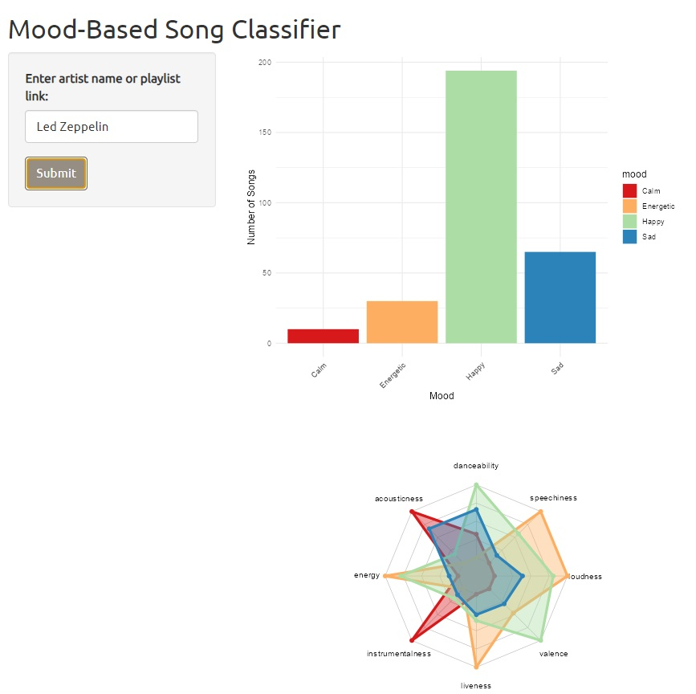

```{r setup, include=FALSE}
# Load and install required libraries

packages <- c("ggplot2","stevetemplates","kableExtra","glmnet", "fmsb","caret","tidyr","dplyr","GGally")

# Install packages not yet installed
installed_packages <- packages %in% rownames(installed.packages())
if (any(installed_packages == FALSE)) {
  install.packages(packages[!installed_packages])
}

# Packages loading
invisible(lapply(packages, library, character.only = TRUE))

#kableExtra options
options(kableExtra.latex.load_packages = TRUE)

#knitr document options
tidy.opts = list(width.cutoff = 80)
knitr::opts_chunk$set(cache=TRUE, echo = FALSE,
                      message=FALSE, warning=FALSE,
                      time_it = TRUE,
                      fig.pos = "H", out.extra = "",
                      fig.path='figs/',
                      cache.path = '_cache/',
                      fig.process = function(x) {
                      x2 = sub('-\\d+([.][a-z]+)$', '\\1', x)
                      if (file.rename(x, x2)) x2 else x
                      })


# Set graphic colors
library(RColorBrewer)
coul <- brewer.pal(4, "Spectral")
colors_border <- coul
library(scales)
colors_in <- alpha(coul,0.4)

```

# Introduction.
Music, among other art forms, has an special ability to evoke emotions, shaping our experiences and perceptions. In this article, we will delve into the intricate relationship between music and emotions, using machine learning techniques to analyze and categorize songs based on their emotional content.

Building on previous research [@data1], we will classify songs into four primary emotional categories: energetic, happy, calm, and sad. To achieve this, we'll leverage a dataset[^1] of 686 previously classified songs and develop a robust model capable of discerning the encoded emotionality within musical compositions.

```{r}
music_data <- read.csv(file = 'data_moods.csv', header=TRUE,sep = ',')

music_data <- subset(music_data, select = c("name","artist", "album","id", "danceability", "acousticness", "energy", "instrumentalness", "liveness", "valence", "loudness", "speechiness", "tempo","mood"))

head(music_data) %>%
  kbl(booktabs = T, caption = "Pre-classified dataset used to train the model") %>%
  kable_styling(latex_options = c("striped", "scale_down","hold_position"), position = "center")

```

We will follow a systematic approach, using different machine learning algorithms to train a model that can accurately identify the mood of a song. We achieve this by utilizing key parameters such as danceability, acousticness, energy, instrumentalness, liveness, valence, loudness and speechiness, obtained directly from the [Spotify](https://open.spotify.com/intl-es) API [@spotifydeveloper]

After obtaining the best model possible, we will apply it in a basic Shiny app, where we've built a Python-based scraping algorithm to gather essential features and attributes of songs using Spotify API [@spotifydeveloper], allowing us to predict the corresponfing mood of each song, and analyze the data desired by the user.

# Exploratory Data Analysis

After an initial inspection of the dataset, we will take first all the variables obtained from the Spotify API to fit our model. Fig. \ref{fig:features} contains a pairs plot of each feature with respect to each mood. Some of the features, such as danceability, or tempo, appears to have a gaussian distribution for all modes (centered in different values). Others, such as valence or loudness, have different skewed distributions.

```{r features,fig.cap= "Features inspection with respect to each mood labeled."}
numeric_data_plot <- subset(music_data, select = c("danceability", "acousticness", "energy", "instrumentalness", "liveness", "valence", "loudness", "speechiness", "tempo","mood"))

# Convert mood to a factor variable
numeric_data_plot$mood <- factor(numeric_data_plot$mood)


numeric_data_plot %>% ggpairs(., 
               mapping = ggplot2::aes(colour=mood), 
               lower = list(continuous = wrap("points", alpha = 0.3, size=0.1), 
                            discrete = "blank", combo="blank"), 
               diag = list(discrete="barDiag", 
                           continuous = wrap("densityDiag", alpha=0.5 )), 
               upper = list(combo = wrap("box_no_facet", alpha=0.5),
                            continuous = wrap("points", alpha = 0.3, size=0.1))) + 
               theme(panel.grid.major = element_blank(),axis.text.x = element_text(angle =45, hjust = 1),axis.text.y = element_text(angle =45, hjust = 1)) + 
   scale_fill_manual(values=coul) +
   scale_color_manual(values=coul)


```

Also, from the scatter plots appearing in \ref{fig:features}, we can see that some of the variables are highly correlated. \ref{fig:cor} contains the correlation matrix for the variables, presenting both negative and positive correlation among some of the features, such as loudness with energy (positive) and aciusticness with energy (negative). 

```{r cor, fig.cap= "Correlation plot of the features."}
# Plot correlation matrix with ggcorr
correlations <- ggcorr(numeric_data_plot, 
       method = c("everything", "pearson"),
       label = TRUE, # Add numerical values
       label_round = 2, # Round numerical values to 2 decimal places
       label_size = 3, # Set size for numerical value labels
       hjust = 0.5, vjust = 0.5, # Adjust label position
       colors = c("#FFFFFF", "#7F0000"))
correlations 
```
If we inspect closer the distribution of moods in our dataset, (Fig.\ref{fig:count}), we can see that our dataset is pretty balanced, containing more than enough songs to characterize each mood.

```{r count, fig.cap = "Histogram of the amount of songs classified in each emotion"}
# Check the distribution of songs across different moods
mood_counts <- table(music_data$mood)

# Plot the distribution of songs across different moods
h <- ggplot(data = data.frame(mood = names(mood_counts), count = as.numeric(mood_counts)), aes(x = mood, y = count, fill = mood)) +
  geom_bar(stat = "identity") +
  labs(x = "Mood",
       y = "Number of Songs") +
  theme_minimal() +
  theme(axis.text.x = element_text(angle = 45, hjust = 1))

h + scale_fill_manual(values=coul) + theme(legend.text = element_text(face = "italic"), legend.title = element_text(size = 12,face = "bold.italic", family = "Helvetica"),
    panel.background = element_rect(fill = NA)) + theme(axis.title = element_text(family = "sans"),
    axis.text = element_text(family = "sans"),
    plot.title = element_text(family = "sans"),
    legend.text = element_text(family = "sans"),
    legend.title = element_text(family = "sans"))
```
Lastly, Fig \ref{fig:radar} shows a characterization of each of the moods using a Radar plot. As you can see, calm songs are characterized by being both heavily acoustic and instrumental, while happy songs are highly danceable and energetic, being moderatelly loud. Sad songs seems to be very valanced in every aspect except from speechiness and energetic songs are characterized by being energetic and loud.

```{r radar, fig.cap =  "Radar plot showcasing the average values of the features that characterize each of the moods"}
# Load necessary libraries
library(ggplot2)
library(dplyr)
library(tidyr)


# Select the required variables
vars_of_interest <- c("danceability", "acousticness", "energy", "instrumentalness", "liveness", "valence", "loudness", "speechiness")

averages <- music_data %>%
  group_by(mood) %>%
  summarise(across(vars_of_interest, mean))


averages <- as.data.frame(averages)
rownames(averages) <- averages$mood


radarchart(averages[,-1]  , axistype=0 , maxmin=F,
    #custom polygon
    pcol=colors_border , pfcol=colors_in , plwd=4 , plty=1,
    #custom the grid
    cglcol="grey", cglty=1, axislabcol="black", cglwd=0.8, 
    #custom labels
    vlcex=0.8 
    )


# Add a legend
legend(x=1.4, y=1, legend = rownames(averages), bty = "n", pch=20 , col=colors_in , text.col = "grey", cex=1.2, pt.cex=3)
```

# Methodolody

To train our models, we have split our dataset into a training set (80%) and a test set (20%). Shuffling is not necessary as the dataset is not ordered. Our approach to finding the best model involves fitting several models using all numerical features available in our dataset, including 'danceability', 'acousticness', 'energy', 'instrumentalness', 'liveness', 'valence', 'loudness', 'speechiness', and 'tempo'. Afterwards, we will select the best performing model and improve it through feature selection and hyperparameter tuning. The model with the highest performance will then be refitted with the entire dataset and integrated into our Shiny app. To fit all the models, `caret` package [@caret] will be used, 5-folds CV will be applied, and we will center and scale the predictors.

```{r}
numeric_data <- subset(music_data, select = c("danceability", "acousticness", "energy", "instrumentalness", "liveness", "valence", "loudness", "speechiness", "tempo","mood"))

set.seed(123)
spl = createDataPartition(numeric_data$mood, p = 0.8, list = FALSE)  # 80% for training

Train = numeric_data[spl,]
Test = numeric_data[-spl,]
```

## Multinomial Logistic Regression

We will begin by applying the most basic model, which is a logistic regression. In this case, we will use a multinomial logistic regression since our categories are not binary.

```{r log_reg}
set.seed(123)
ctrl <- trainControl(method = "cv", number = 5,
                     classProbs = TRUE, 
                     verboseIter=FALSE)

# We have many predictors, hence use penalized logistic regression
lrFit <- train(mood ~ ., 
               method = "multinom",
               metric = "Kappa",
               data = Train,
               preProcess = c("center", "scale"),
               trControl = ctrl,
               trace = FALSE)
print(lrFit)
lrPred = predict(lrFit, Test)
confusionMatrix(lrPred, as.factor(Test$mood))
```

Although multinomial logistic regression model appears to be effective in classifying songs into their respective moods, with an accuracy of ~80% and $\kappa = 0.76$,we will keep trying more appropriate methods for non-binary classification problems, such as LDA for $p>1$. Before that, lets have a look at the coefficients computed for each variable

```{r}
sum.mnl.c <- summary(lrFit)
z <- sum.mnl.c$coefficients / sum.mnl.c$standard.errors
p <- (1 - pnorm(abs(z), 0, 1)) * 2
# Coefficients for quality = 6

coeff.mnl.c1 <- rbind(sum.mnl.c$coefficients[1,],
                      sum.mnl.c$standard.errors[1,],
                      z[1,],
                      p[1,])

rownames(coeff.mnl.c1) <- c("Coefficient", "Std. Errors", 
                            "z stat", "p value")

coeff.mnl.c1 %>%
  kbl(booktabs = T, caption = "Coefficients for mood = Energetic") %>%
  kable_styling(latex_options = c("striped", "scale_down","hold_position"), position = "center")

# Coefficients for quality = 7

coeff.mnl.c2 <- rbind(sum.mnl.c$coefficients[2,],
                      sum.mnl.c$standard.errors[2,], 
                      z[2,], 
                      p[2,])

rownames(coeff.mnl.c2) <- c("Coefficient", "Std. Errors",
                            "z stat", "p value")

coeff.mnl.c2 %>%
  kbl(booktabs = T, caption = "Coefficients for mood = Happy") %>%
  kable_styling(latex_options = c("striped", "scale_down","hold_position"), position = "center")

# Coefficients for quality = 3489

coeff.mnl.c3 <- rbind(sum.mnl.c$coefficients[3,],
                      sum.mnl.c$standard.errors[3,],
                      z[3,],
                      p[3,])

rownames(coeff.mnl.c3) <- c("Coefficient", "Std. Errors", 
                            "z stat", "p value")

coeff.mnl.c3 %>%
  kbl(booktabs = T, caption = "Coefficients for mood = Sad") %>%
  kable_styling(latex_options = c("striped", "scale_down","hold_position"), position = "center")


```

As we can see in the tables above, some of the coefficients do not affect the dependent variable. This is due to the multicolinearity found before in Fig. \ref{fig:cor}.

## Linear Discriminant Analysis (LDA, p > 1)

```{r LDA}
# Perform LDA
set.seed(123)
ldaFit <- train(mood ~ ., 
                method = "lda",  
                metric = "Kappa",
                data = Train,
                preProcess = c("center", "scale"),
                trControl = ctrl,
                trace = FALSE)

# Print the LDA model
print(ldaFit)

# Make predictions using the trained model
ldaPred <- predict(ldaFit, Test)

# Compute confusion matrix
confusionMatrix(ldaPred, as.factor(Test$mood))

```

the LDA and logistic regression predictions are almost identical, as Section 4.5 of [@book] discusses.

## Quadratic Discriminant Analysis (QDA)
  
```{r}
# Perform QDA
set.seed(123)
qdaFit <- train(mood ~ ., 
                method = "qda",  # Set the method to "qda" for Quadratic Discriminant Analysis
                metric = "Kappa",
                data = Train,
                preProcess = c("center", "scale"),
                trControl = ctrl,
                trace = FALSE)

# Print the QDA model
print(qdaFit)

# Make predictions using the trained model
qdaPred <- predict(qdaFit, Test)

# Compute confusion matrix
confusionMatrix(qdaPred, as.factor(Test$mood))
```
Up to this point, the three models fitted seems to perform very similarly on our dataset. To wrap up the model testing, we will fit try Naive Bayes 

## Naive Bayes 

```{r}
# Perform Naive Bayes
set.seed(123)
nbFit <- train(mood ~ ., 
               method = "nb",  # Set the method to "nb" for Naive Bayes
               metric = "Kappa",
               data = Train,
               preProcess = c("center", "scale"),
               trControl = ctrl,
               trace = FALSE)

# Print the Naive Bayes model
print(nbFit)

# Make predictions using the trained model
nbPred <- predict(nbFit, Test)

# Compute confusion matrix
confusionMatrix(nbPred, as.factor(Test$mood))
```

We can compare the four models applyied using `resamples` function from the `caret` package [@caret] 

```{r resamp, fig.cap = "Resampling results using `resamples` function from the `caret` package [@caret] "}
set.seed(123)
# Resample the models
comparison <- resamples(list(MLR = lrFit,
            LDA = ldaFit,
            QDA = qdaFit,
            NB = nbFit))

# Summarize the results
theme1 <- trellis.par.get()
theme1$plot.symbol$col = rgb(.2, .2, .2, .4)
theme1$plot.symbol$pch = 16
theme1$plot.line$col = rgb(1, 0, 0, .7)
theme1$plot.line$lwd <- 2
trellis.par.set(theme1)
bwplot(comparison, layout = c(3, 1))
```
The main results obtained from Fig. \ref{fig:resamp} can be summarized as follows:

Accuracy:

  - Logistic Regression (MLR): Mean accuracy of approximately $79.82 \%$
  - Linear Discriminant Analysis (LDA): Mean accuracy of approximately $77.45 \%$
  - Quadratic Discriminant Analysis (QDA): Mean accuracy of approximately $78.36 \%$
  - Naive Bayes (NB): Mean accuracy of approximately $79.64 \%$

Kappa:

  - Logistic Regression (MLR): Mean Kappa of approximately 0.7288
  - Linear Discriminant Analysis (LDA): Mean Kappa of approximately 0.6976
  - Quadratic Discriminant Analysis (QDA): Mean Kappa of approximately 0.7092
  - Naive Bayes (NB): Mean Kappa of approximately 0.7267
  
  
Based on these metrics, the logistic regression model (MLR) has the highest mean accuracy and Kappa value among the four models. It is also convenient in terms of interpretability and computational efficiency. Therefore, the logistic regression model may be considered the best model for this classification task. 


## Feature selection on Multinomial Linear Regression

Lets apply BIC criterion to perform feature selection:

```{r}
# Load necessary libraries
library(MASS)

# Set seed for reproducibility
set.seed(123)

# Define train control
ctrl <- trainControl(method = "cv", number = 5,
                     classProbs = TRUE, 
                     verboseIter=FALSE)

# Fit the models with different numbers of predictors
models <- list()
bic_values <- numeric(ncol(Train)-1)
for (i in 1:(ncol(Train)-1)) {
  formula <- as.formula(paste("mood ~ ", paste(names(Train)[-1][1:i], collapse = " + ")))
  model <- train(formula, 
                 method = "multinom",
                 metric = "Kappa",
                 data = Train,
                 preProcess = c("center", "scale"),
                 trControl = ctrl,
                 trace = FALSE)
  models[[i]] <- list(formula = formula, model = model)
  
  # Calculate BIC for each model
  bic_values[i] <- BIC(model$finalModel)
}

# Calculate BIC for each model
bics <- sapply(models, function(x) BIC(x$model$finalModel))

# Find the model with the lowest BIC
best_model_index <- which.min(bics)
best_model <- models[[best_model_index]]

# Print the best model and its BIC
cat("Best model formula:", as.character(best_model$formula), "\n")
cat("BIC:", bics[best_model_index], "\n")

```

```{r BIC, fig.cap= "Evolution of BIC with Number of Predictors"}
# Plot BIC evolution
# Create a data frame for plotting
plot_data <- data.frame(
  num_predictors = 1:(ncol(Train)-1),
  bic_values = bic_values
)

# Create the plot
ggplot(plot_data, aes(x = num_predictors, y = bic_values)) +
  geom_line() +
  geom_point() +
  geom_vline(xintercept = best_model_index, linetype = "dashed", color = "red") +
  labs(
    x = "Number of Predictors",
    y = "BIC",
    title = 
  ) +
  theme_minimal()

```
The best model found, based in BIC criterion, is `mood ~ acousticness + energy + instrumentalness + liveness + valence + loudness` with a $BIC = 608.80". Fitting this model:

```{r}
set.seed(123)
lrFit <- train(best_model$formula, 
               method = "multinom",
               metric = "Kappa",
               data = Train,
               preProcess = c("center", "scale"),
               trControl = ctrl,
               trace = FALSE)
print(lrFit)
lrPred = predict(lrFit, Test)
confusionMatrix(lrPred, as.factor(Test$mood))

```
In this case, since we want to increase the accuracy as much as possible to improve the classification process, we will use all the predictors available to fit the model. Thus, the final model used in our Shiny app will be the following:

```{r, echo=TRUE}

ctrl <- trainControl(method = "cv", number = 5,
                     classProbs = TRUE, 
                     verboseIter=FALSE)

log.fit = train(mood ~ acousticness + energy + instrumentalness + liveness + valence + loudness, 
               method = "multinom",
               metric = "Kappa",
               data = numeric_data,
               preProcess = c("center", "scale"),
               trControl = ctrl,
               trace = FALSE)
# Save the trained model
saveRDS(log.fit, "trained_model.rds")

```


When applying in a future Machine Learning for classification, KNN is expected to outperform LDA and logistic regression in cases where the decision boundary is highly non-linear,
given a large n and small p, because KNN is non-parametric.
However, accurate classification with KNN requires a substantial number of observations relative to the number of predictors, meaning that n must be much larger.
The non-parametric nature of KNN reduces bias but incurs a high level
of variance, which can result in a decision boundary that is non-linear when n is moderate or p
is not very small.
In such situations, QDA may be a
more suitable option than KNN as it can provide a non-linear decision boundary while taking advantage of a parametric form.
This results in a smaller required sample size for accurate classification
compared to KNN.

# Shiny app

Now, we can feed our final model to the Shiny app we've build for the user to analyse their playlist and favorite artist! 

```{r shiny, out.width='80%', fig.align='center', fig.cap= "Screenshot of the Shiny app.",echo = FALSE}

```


[^1]: The dataset used to train our model can be found in [Kaggle](https://www.kaggle.com/datasets/musicblogger/spotify-music-data-to-identify-the-moods)


# References
\setlength{\parindent}{-0.2in}
\setlength{\leftskip}{0.2in}
\setlength{\parskip}{8pt}
\vspace*{-0.2in}
\noindent

